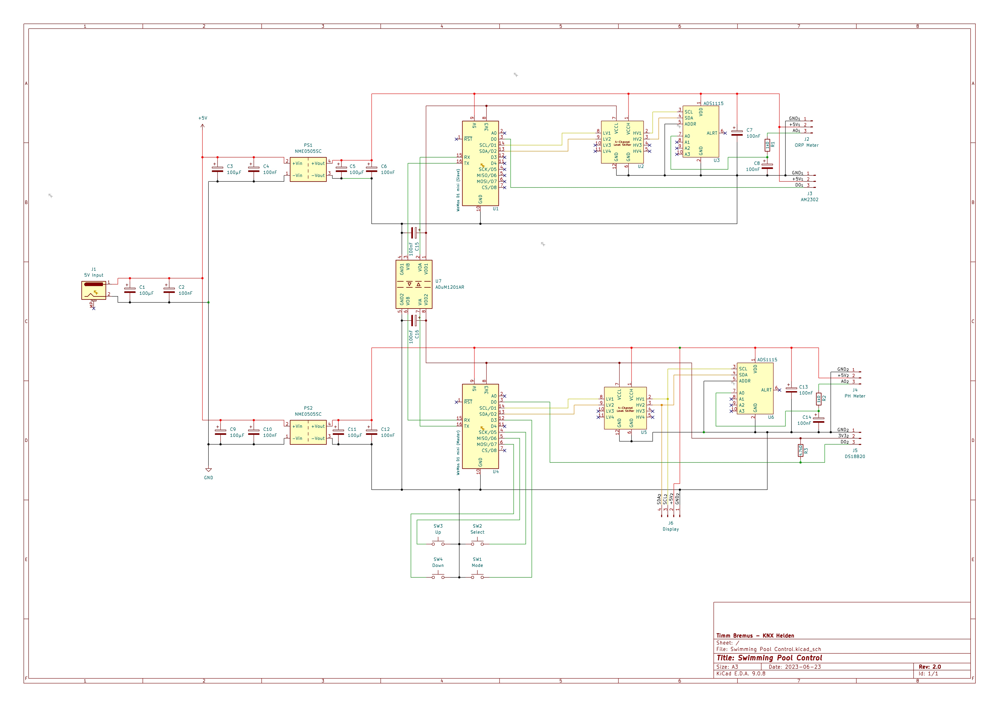

# 🔌 Electronics

## 📖 Overview

The electronic design of **Swimming Pool Control** is focused on reliable and stable measurement of critical pool water parameters while keeping the system modular and extensible.

The controller is split into two isolated branches:

- 🧪 **pH measurement branch**
- ⚡ **ORP / Redox measurement branch**

Each branch uses its own:

- **Wemos D1 mini**
- **isolated power supply**
- **ADS1115 ADC**
- **dedicated sensor interface**

This separation helps reduce interference between both analog measurement paths and improves measurement stability.

---

## 🏗️ System Architecture

The system consists of two ESP8266-based controller nodes:

### 🧠 Master
The master node is responsible for:

- local user input via buttons
- display output
- main application logic
- pH measurement
- water temperature measurement
- communication with the slave node

### 📡 Slave
The slave node is responsible for:

- ORP / Redox measurement
- ambient temperature measurement
- providing measurement data to the master via isolated UART communication

---

## ⚡ Power Supply Concept

The complete system is powered from a **5V input supply**.

To keep both measurement branches electrically separated, each controller branch uses its own isolated DC/DC converter:

- **PS1** for the master branch
- **PS2** for the slave branch

This creates two isolated local supply domains, which helps minimize unwanted coupling between the analog measurement circuits.

### Power filtering

Both isolated supply branches use local decoupling capacitors:

- **100 µF** bulk capacitors
- **100 nF (0.1 µF)** ceramic capacitors

These capacitors are placed at the input and output of the isolated DC/DC converters to improve supply stability and suppress noise.

Additional **100 nF** decoupling capacitors are placed close to sensitive ICs such as:

- ADS1115 ADCs
- digital isolator for UART communication

---

## 📏 Analog Measurement Design

Accurate analog measurement is one of the main priorities of this project.

Instead of using the internal ADC of the ESP8266, each measurement branch uses its own external **ADS1115** ADC.

### Why ADS1115?

The ADS1115 was selected because it offers:

- better resolution than the ESP8266 internal ADC
- improved stability for slow analog signals
- I²C interface for simple integration
- better suitability for pH and ORP signal acquisition

### Analog input filtering

Each analog sensor output is connected to the ADC through a simple RC filter:

- **1 kΩ series resistor**
- **100 nF capacitor to GND**

This filter helps suppress high-frequency noise and stabilize the signal before it reaches the ADC input.

---

## 🔀 Level Shifting

The pH and ORP sensor boards as well as the display are operated on the **5V side**.

Because the Wemos D1 mini uses **3.3V logic**, each branch includes an **I²C level shifter** between:

- the Wemos (3.3V side)
- the ADS1115 / display bus (5V side)

This ensures safe and reliable I²C communication between the controller and the connected peripherals.

---

## 🔒 Isolated UART Communication

The master and slave controllers communicate via **UART**.

To preserve the galvanic isolation between both controller branches, the UART connection is not wired directly.  
Instead, a **digital isolator (ADuM1201)** is used between both Wemos modules.

### Benefits of isolated UART

- keeps both controller domains galvanically separated
- reduces the risk of coupling noise between measurement branches
- helps preserve stable pH and ORP measurements
- allows reliable controller-to-controller communication on the same PCB

The isolator is powered separately on both sides and includes local **100 nF** decoupling capacitors for both isolated supply domains.

---

## 🌡️ Sensors and Interfaces

The current design supports the following sensor and interface components:

- **DFRobot pH sensor module**
- **DFRobot ORP sensor module**
- **DS18B20 temperature sensor**
- **I²C display**
- **4 push buttons** for local user interaction

### Button inputs

The master node provides four button inputs for later menu navigation and user interaction.

Typical functions:

- ⬆️ Up
- ⬇️ Down
- ✅ Select
- ⚙️ Mode

The buttons are connected to GPIO pins and use internal pull-up resistors.

---

## 🧩 Main Components

### Controllers
- 2x **Wemos D1 mini** (ESP8266)

### ADCs
- 2x **ADS1115**

### Sensor Modules
- 1x **DFRobot pH sensor board**
- 1x **DFRobot ORP sensor board**
- 1x **DS18B20 temperature sensor**
- 1x **AM2302 temperature and humidity Sensor**

### Isolation and Signal Conditioning
- 2x **isolated 5V DC/DC converters** (`NME0505SC`)
- 2x **I²C level shifters**
- 1x **ADuM1201 digital isolator** for UART
- RC filters on analog inputs (**1 kΩ + 100 nF**)

### Passive Components
- **100 µF** electrolytic capacitors for bulk decoupling
- **100 nF / 0.1 µF** ceramic capacitors for local decoupling
- **4.7 kΩ** pull-up resistor for DS18B20
- **1 kΩ** resistors for ADC input filtering

### User Interface
- 1x **I²C display**
- 4x **push buttons**

---

## 🎯 Design Goals

The electronics were designed with the following priorities in mind:

- ✅ stable pH and ORP measurement
- ✅ reduced interference between analog channels
- ✅ clear separation between master and slave tasks
- ✅ modular and maintainable architecture
- ✅ reliable local operation with display and buttons
- ✅ future extensibility for pump and heater control

---

## 🛠️ Notes

This hardware design is still under active development and may evolve over time as practical testing and calibration progress.

The current schematic is focused on:

- signal stability
- isolated measurement domains
- safe communication between controller nodes
- practical integration of analog water quality sensors